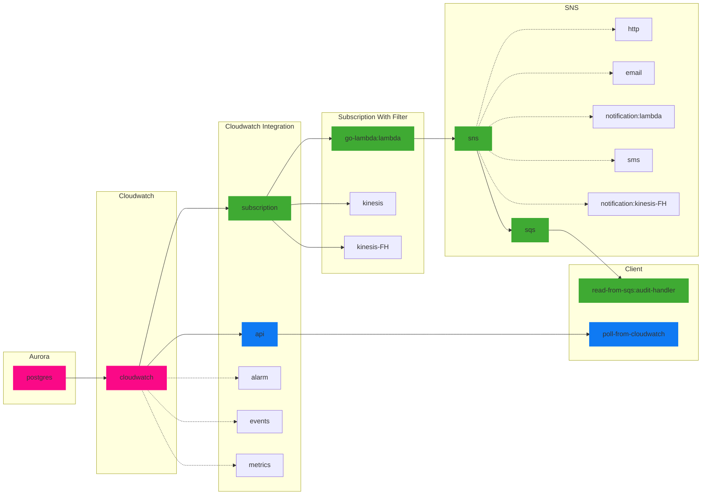

## Forwarding Postgres Logs

Logs of interest are forwarded to Postgres using a custom RDS parameters settings.

### project: poll-from-cloudwatch

Read from CloudWatch using Filter endpoint. This is a polling exercise. This can be quick way of reading cloudwatch from
outside EC2 environment

Filter performs a filter for connection, execute and disconnection events

### project: go-lambda

Lambda that forwards messages to a SNS topic. Lambda performs a filter for connection, execute and disconnection events

#### setup lamdda

Refer to lambda.md to setup lambda

#### project: read-from-sqs

To read SQS messages and delete upon receipt. read.md has instructions to publish locally as well as read locally.
